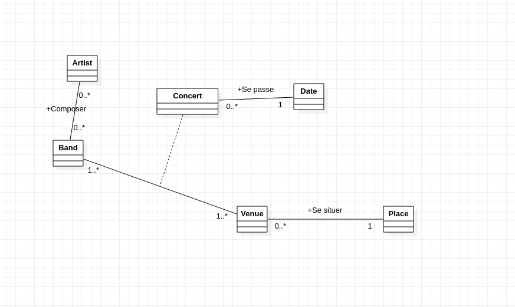

# concertProject

Projet en symfony sur un site de gestion de concert

## Nice to Have réalisé :
  - Quand l’utilisateur est logué, au lieu de « Login », s’affiche dans la navBar :
« Bonjour [nomUserLogué] »
  - Upload d’images

### Diagramme de class :

